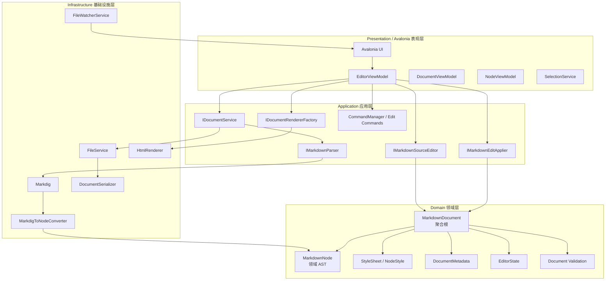
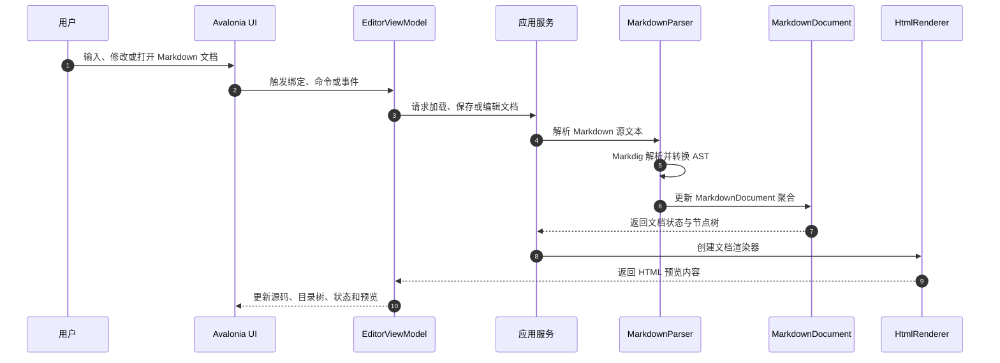
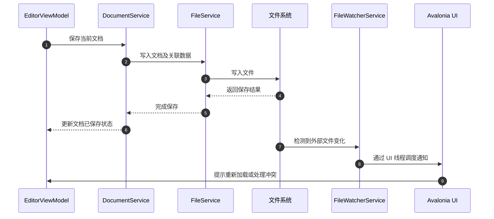

# CollabPlatform.Client.Hosts.Avalonia.MarkdownEditor

基于 **Avalonia** 的跨平台 Markdown 编辑器组件，采用 **领域驱动设计（DDD，Domain-Driven Design）** 的分层架构，将 Markdown 文本解析、内部抽象语法树建模、结构化编辑、样式管理、HTML 预览、文件持久化与文件变更监视等能力进行解耦。

项目以 `MarkdownDocument` 作为核心领域聚合根，使用统一的 `MarkdownNode` 领域 AST 承载文档结构，使 Markdown 源码、目录树、样式配置、编辑命令和渲染输出能够围绕一致的领域模型协作。

---

## 特性

- 基于 **Avalonia + MVVM** 的编辑器表现层与 ViewModel 支持；
- 采用 **DDD 模型驱动设计**，以领域模型而非第三方库 AST 作为系统核心；
- 基于 **Markdig** 构建 Markdown 解析管线；
- 支持常用 Markdown 扩展：
  - Pipe Tables（管道表格）；
  - Task Lists（任务列表）；
  - Footnotes（脚注）；
  - YAML Front Matter；
- 将 Markdig AST 转换为内部统一的 `MarkdownNode` 领域 AST；
- 支持标题、段落、列表、引用、表格、代码块、链接、图片、强调、删除线等节点建模；
- 支持文档树、标题层级和节点父子关系管理；
- 支持基于源码区间的 Markdown 编辑：
  - 文本范围替换；
  - 标题级别调整；
  - 撤销与重做；
- 支持解析后节点身份匹配，尽可能维持编辑过程中的节点标识稳定性；
- 支持 Markdown 节点样式、样式表、局部样式及样式变更追踪；
- 支持 HTML 渲染与实时预览；
- 预览更新采用防抖与取消机制，避免高频输入造成无效渲染；
- 支持 Markdown 文档、样式、元数据和编辑器状态的持久化；
- 支持文档修订版本、保存状态、样式指纹及修改状态识别；
- 支持文件变更监视与 UI 线程调度抽象；
- 通过 `Microsoft.Extensions.DependencyInjection` 一键注册全部服务。

---

## 技术栈

| 技术 / 组件 | 用途 |
|---|---|
| [.NET](https://dotnet.microsoft.com/) | 运行时与开发平台 |
| [Avalonia](https://avaloniaui.net/) | 跨平台桌面 UI 框架 |
| [Markdig](https://github.com/xoofx/markdig) | Markdown 解析引擎 |
| `Microsoft.Extensions.DependencyInjection` | 依赖注入与服务组合 |
| MVVM | 表现层 UI 状态和交互管理 |
| DDD | 领域模型、聚合、分层架构与业务规则封装 |

---

## DDD 模型驱动设计

本项目采用 **领域驱动设计（DDD）** 思想构建 Markdown 编辑器，而不是让 UI、Markdig AST 或文件系统直接主导业务逻辑。

核心设计原则如下：

1. **领域模型是系统核心**  
   `MarkdownDocument` 是文档领域的聚合根，统一管理源码、AST、样式、元数据、编辑器状态、修订版本与保存状态。

2. **内部 AST 与第三方实现隔离**  
   Markdig 仅承担 Markdown 解析职责。其生成的 AST 会经由 `MarkdigToNodeConverter` 转换为内部统一的 `MarkdownNode` 领域模型，避免上层业务直接依赖第三方 AST。

3. **业务规则封装在领域层**  
   文档修改状态、节点树合法性、节点唯一标识、父子引用关系、编辑器选区归一化、样式指纹等规则由领域模型负责维护。

4. **应用层编排用例**  
   应用层通过接口定义文档打开、保存、解析、编辑和渲染等用例，协调领域对象与基础设施实现。

5. **基础设施可替换**  
   Markdig 解析、HTML 渲染、文件读写、序列化、文件监听等技术细节位于基础设施层，可在不破坏领域模型的前提下替换实现。

---

## 总体架构

项目遵循以下分层结构：

```text
Presentation → Application → Domain → Infrastructure
```



---

## 分层职责

| 层级 | 职责 | 主要组件 |
|---|---|---|
| `Presentation` | Avalonia UI 交互、数据绑定、命令触发、编辑器状态展示与 HTML 预览更新 | `EditorViewModel`、`DocumentViewModel`、`NodeViewModel`、`SelectionService` |
| `Application` | 编排文档打开、保存、解析、编辑、渲染等应用用例，对外提供抽象接口 | `IDocumentService`、`IMarkdownParser`、`IMarkdownSourceEditor`、`IMarkdownEditApplier`、`IDocumentRendererFactory` |
| `Domain` | 定义 Markdown 文档的核心业务模型、规则、状态与校验能力 | `MarkdownDocument`、`MarkdownNode`、`StyleSheet`、`DocumentMetadata`、`EditorState` |
| `Infrastructure` | 实现 Markdown 解析、AST 转换、HTML 渲染、文件读写、序列化和文件监视 | `MarkdownParser`、`MarkdigToNodeConverter`、`HtmlRenderer`、`FileService`、`FileWatcherService` |

---

## 核心领域模型

### `MarkdownDocument`

`MarkdownDocument` 是整个编辑器领域的**核心聚合根**，代表一个完整 Markdown 文档的业务状态。

```text
MarkdownDocument
├── Id                    文档唯一标识
├── FilePath              文档文件路径
├── SourceMarkdown        Markdown 原始文本
├── Root                  MarkdownNode AST 根节点
├── StyleSheet            文档样式表
├── Metadata              文档元数据
├── EditorState           编辑器状态
├── SourceRevision        源码修订版本
├── SavedSourceRevision   已保存源码修订版本
├── StyleRevision         样式修订版本
└── SavedStyleRevision    已保存样式修订版本
```

其主要职责包括：

- 维护 Markdown 源文本和解析后的节点树；
- 管理文档样式、元数据及编辑器状态；
- 标识源码与样式是否发生修改；
- 管理保存前后的修订版本；
- 校验 AST 根节点、节点 ID、父子关系等领域约束；
- 在文档更新后归一化光标位置、选区和已展开节点状态；
- 为样式、元数据和节点局部配置生成指纹，以辅助判断样式变更。

### `MarkdownNode`

`MarkdownNode` 是项目内部统一的 Markdown 抽象语法树节点模型。

每个节点可承载以下信息：

- 节点唯一标识；
- 节点类型与节点分类；
- 文本内容；
- 父节点及子节点；
- 标题层级；
- Markdown 源文本范围；
- 节点属性，例如链接地址、图片地址、代码语言；
- 关联样式标识与局部样式；
- 表格表头标记等结构化信息。

通过 `MarkdownNode`，项目将 Markdown 源码转换为可被目录树、结构化编辑器、样式系统和 HTML 渲染器共同使用的领域对象。

---

## Markdown 解析

项目使用 Markdig 作为底层 Markdown 解析引擎，并通过 `MarkdigToNodeConverter` 将 Markdig AST 转换为项目内部的 `MarkdownNode` AST。

默认支持以下解析扩展：

| 配置项 | 默认值 | 说明 |
|---|---:|---|
| `EnablePipeTables` | `true` | 启用管道表格解析。 |
| `EnableTaskLists` | `true` | 启用任务列表解析。 |
| `EnableFootnotes` | `true` | 启用脚注解析。 |
| `EnableYamlFrontMatter` | `true` | 启用 YAML Front Matter 解析。 |

### Markdown 示例

````text
---
title: 示例文档
author: MarkdownEditor
---

# MarkdownEditor

- [x] 支持任务列表
- [ ] 支持未完成任务

| 名称 | 说明 |
| --- | --- |
| Markdown | 文档格式 |
| Avalonia | 跨平台 UI 框架 |

这是一个脚注示例。[^1]

[^1]: 脚注内容。

```csharp
Console.WriteLine("Hello MarkdownEditor");
```
````

---

## 编辑与预览流程



### 实时预览机制

`EditorViewModel` 负责协调文档服务、源码编辑服务、编辑应用器和 HTML 渲染器：

1. 文档被打开或修改后，ViewModel 获取当前 `MarkdownDocument`；
2. 使用 `IDocumentRendererFactory` 创建对应渲染器；
3. 预览更新默认采用约 `150ms` 防抖；
4. 新输入会取消尚未完成的旧预览任务；
5. 渲染结果通过 UI 线程调度回写至 `HtmlPreview`；
6. UI 通过数据绑定更新预览区域。

---

## 文档编辑与命令管理

项目通过命令模式管理编辑操作，便于支持撤销与重做。

```text
用户操作
  ↓
EditorViewModel
  ↓
编辑命令（ChangeTextCommand / ChangeHeadingLevelCommand）
  ↓
IMarkdownEditApplier + IMarkdownSourceEditor
  ↓
MarkdownDocument
  ↓
重新解析 / 更新预览
```

支持的典型操作包括：

- 文本区间替换；
- 标题级别调整；
- 命令栈撤销；
- 命令栈重做；
- 修改后 HTML 预览刷新；
- 修改状态同步更新。

---

## 文件保存与外部变更处理



文档领域模型通过源码修订版本、样式修订版本、已保存版本及样式指纹识别文档状态：

| 状态 | 说明 |
|---|---|
| `IsSourceModified` | Markdown 源码相对于保存版本已发生变化。 |
| `IsStyleModified` | 样式配置相对于保存版本已发生变化。 |
| `IsModified` | 源码或样式任一发生变化。 |
| `MarkSaved()` | 将当前状态标记为已保存。 |
| `Validate()` | 验证文档树与领域约束。 |

---

## 依赖注入

项目提供 `AddMarkdownEditor` 扩展方法，用于注册 Markdown 编辑器所需的领域、应用、基础设施和表现层服务。

```csharp
using CollabPlatform.Client.Hosts.Avalonia.MarkdownEditor.Presentation.Avalonia.Composition;
using Microsoft.Extensions.DependencyInjection;

var services = new ServiceCollection();

services.AddMarkdownEditor(options =>
{
    options.EnablePipeTables = true;
    options.EnableTaskLists = true;
    options.EnableFootnotes = true;
    options.EnableYamlFrontMatter = true;
});

var serviceProvider = services.BuildServiceProvider();
```

默认注册的主要服务如下：

| 服务接口 / 类型 | 默认实现 | 生命周期 |
|---|---|---|
| `IMarkdownParser` | `MarkdownParser` | Singleton |
| `IDocumentSerializer` | `DocumentSerializer` | Singleton |
| `IFileService` | `FileService` | Singleton |
| `IDocumentService` | `DocumentService` | Singleton |
| `IMarkdownSourceEditor` | `MarkdownSourceEditor` | Transient |
| `IMarkdownEditApplier` | `MarkdownEditApplier` | Transient |
| `IDocumentRendererFactory` | `HtmlRendererFactory` | Transient |
| `EditorViewModel` | `EditorViewModel` | Transient |
| `IUiThreadDispatcher` | `SynchronizationContextUiThreadDispatcher` | Singleton |
| `IFileWatcherService` | `FileWatcherService` | Singleton |

---

## 使用示例

### 获取编辑器 ViewModel

```csharp
using CollabPlatform.Client.Hosts.Avalonia.MarkdownEditor.Presentation.Avalonia.ViewModels;

var editorViewModel = serviceProvider.GetRequiredService<EditorViewModel>();
```

### 打开 Markdown 文档

```csharp
await editorViewModel.OpenDocumentAsync("README.md");
```

### 保存当前文档

```csharp
await editorViewModel.SaveDocumentAsync();
```

### 修改指定源码范围内的文本

```csharp
var range = new SourceRange
{
    StartOffset = 0,
    Length = 10,
    StartLine = 1,
    StartColumn = 1,
    EndLine = 1,
    EndColumn = 11
};

editorViewModel.ExecuteTextChange(range, "# 新标题");
```

### 调整标题级别

```csharp
var document = editorViewModel.ActiveDocument?.Document;

if (document is not null)
{
    var heading = document.Root.Children
        .FirstOrDefault(node => node.Type == NodeType.Heading);

    if (heading is not null)
    {
        editorViewModel.ExecuteHeadingChange(heading, newLevel: 2);
    }
}
```

### 撤销与重做

```csharp
if (editorViewModel.CanUndo)
{
    editorViewModel.Undo();
}

if (editorViewModel.CanRedo)
{
    editorViewModel.Redo();
}
```

---

## 推荐项目结构

```text
CollabPlatform.Client.Hosts.Avalonia.MarkdownEditor
├── Application
│   ├── Abstractions
│   │   ├── Diagnostics
│   │   ├── Documents
│   │   ├── Editing
│   │   ├── Parsing
│   │   ├── Rendering
│   │   └── Threading
│   ├── Documents
│   └── Editing
│       └── Commands
├── Domain
│   ├── Documents
│   ├── Styling
│   ├── Syntax
│   │   ├── Factories
│   │   └── Matching
│   └── Validation
├── Infrastructure
│   ├── Parsing
│   ├── Persistence
│   │   └── Serialization
│   └── Rendering
│       └── Html
└── Presentation
    └── Avalonia
        ├── Composition
        ├── Services
        └── ViewModels
```

---

## 未来扩展方向

- 完善 Markdown 节点类型与扩展语法支持；
- 提供更丰富的结构化编辑能力；
- 支持可视化样式编辑器；
- 增加 HTML 安全策略与链接协议白名单配置；
- 增加图片、附件及资源文件管理；
- 支持多文档标签页；
- 支持文档差异比较与冲突合并；
- 支持协同编辑与操作日志同步；
- 支持导出 HTML、PDF 或其他文档格式；
- 支持自定义 Markdown 扩展与自定义渲染器。

---

## 设计目标

- **领域优先**：以 `MarkdownDocument` 和 `MarkdownNode` 作为系统稳定核心；
- **技术解耦**：隔离 Avalonia、Markdig、文件系统和渲染实现；
- **可测试性**：应用服务和基础设施服务均通过接口抽象；
- **可扩展性**：可替换解析器、渲染器、持久化方式和 UI 宿主；
- **一致性**：源码、AST、样式、元数据与编辑器状态围绕同一文档聚合协作；
- **工程化**：通过依赖注入、命令模式、修订版本和文件监听提升可维护性。